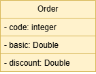
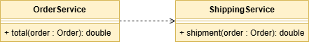

**Formação Desenvolvedor Moderno Módulo**: Back end  
**Capítulo**: Componentes e injeção de dependência

DESAFIO: Componentes e injeção de dependência  
Forma de entrega: link do projeto no Github

Você deve criar um sistema para calcular o valor total de um pedido, considerando uma porcentagem
de desconto e o frete. O cálculo do valor total do pedido consiste em aplicar o desconto ao valor
básico do pedido, e adicionar o valor do frete. A regra para cálculo do frete é a seguinte:

| **Valor Básico do Pedido (Sem Desconto)**      | **Frete**    |
|------------------------------------------------|--------------|
| Abaixo de R$ 100,00                            | R&#36; 20,00 |
| De R&#36; 100,00 até R&#36; 200,00 (exclusive) | R&#36; 12,00 |
| R$ 200.00 ou mais                              | Grátis       |

**Exemplo 1**:

| **ENTRADA**                  | **SAÍDA**                  |
|------------------------------|----------------------------|
| Código do Pedido: 1034       | Pedido código 1034         |
| Valor Básico: R&#36; 150,00  | Valor total: R&#36; 132,00 |
| Porcentagem de Desconto: 20% |                            |

**Exemplo 2**:

| **ENTRADA**                  | **SAÍDA**                  |
|------------------------------|----------------------------|
| Código do Pedido: 2282       | Pedido código 2282         |
| Valor Básico: R&#36; 800,00  | Valor total: R&#36; 720.00 |
| Porcentagem de Desconto: 10% |                            |

**Exemplo 3**:

| **ENTRADA**                 | **SAÍDA**                  |
|-----------------------------|----------------------------|
| Código do Pedido: 1309      | Pedido código 1309         |
| Valor Básico: R&#36; 95,90  | Valor total: R&#36; 115.90 |
| Porcentagem de Desconto: 0% |                            |

Sua solução deverá seguir as seguintes especificações:
Um pedido deve ser representado por um objeto conforme projeto abaixo:

  

A lógica do cálculo do valor total do pedido deve ser implementada por componentes (serviços), cada
um com sua responsabilidade, conforme projeto abaixo:

  

Serviço OrderService: responsável por operações referentes a pedidos.  
Serviço ShippingService: responsável por operações referentes a frete.

Sua solução deverá ser implementada em Java com Spring Boot. A saída deverá ser mostrada no log
do terminal da aplicação. Cada serviço deve ser implementado como um componente registrado com
@Service.